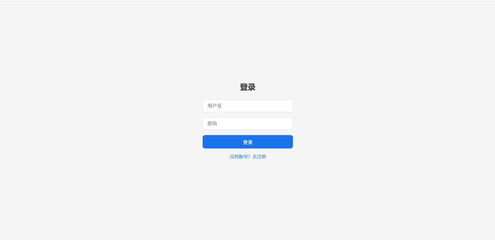
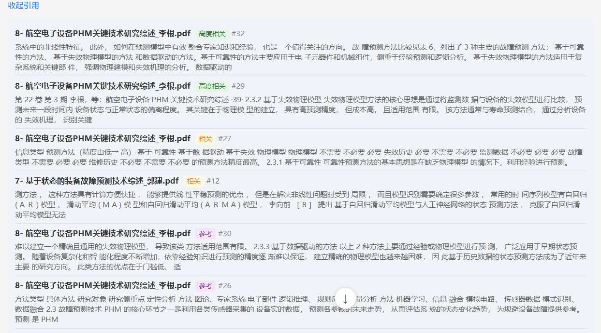

# Mini Agent

基于 LangGraph 的 RAG 知识库问答系统，支持 Multi-Agent 调度、混合检索、文档分析和流式对话。

## 截图

**聊天界面 + 引用卡片**





## Quick Start

```bash
# 1. 配置环境变量
cp .env.example .env          # 本地开发
# 或
cp .env.docker.example .env   # Docker 部署

# 编辑 .env，填入 LLM_API_KEY（必填）
# Docker 部署还需配置 POSTGRES_PASSWORD、MINIO_ACCESS_KEY、MINIO_SECRET_KEY

# 2. 启动
docker compose up -d

# 3. 访问
# 聊天界面：http://localhost:8000
# Admin 页面：http://localhost:8000/admin.html
# API 文档：http://localhost:8000/docs
```

> 首个注册用户自动成为 admin。`JWT_SECRET_KEY` 和数据库密码在生产环境必须修改。

## 核心特性

- **Multi-Agent 调度**：Supervisor 路由（正则快速路径 + LLM 语义路由），分发到 GeneralChat / RAG / Analysis 三个 Agent
- **Hybrid Retrieval**：Dense（HuggingFace Embedding）+ BM25（jieba 分词）+ BM25-primary RRF 融合（HR@8=88%），支持文档级权限过滤、策略可切换
- **文档分析**：单篇分析 + 跨文档对比，smart_truncate 长文档截断（head 40% + tail 40% + mid 20%）
- **流式输出**：SSE 流式返回，支持 agent 通知、token 流、工具调用提示（tool_start）、引用卡片
- **会话持久化**：ChatSession + ChatMessage ORM，历史消息双截断（条数 + token）
- **Admin 管理**：独立管理页面（用户/会话/文档/统计），首用户自动 admin

## 技术栈

| 层级 | 技术 |
|------|------|
| 后端框架 | FastAPI + Uvicorn |
| Agent 引擎 | LangGraph `create_react_agent`（ReAct）+ 确定性流程（analysis_agent） |
| LLM 接口 | LiteLLM（统一 100+ Provider） |
| 向量库 | Milvus（本地 Docker）+ etcd + MinIO |
| 检索策略 | Hybrid Retrieval（Dense + BM25 + BM25-primary RRF / 对称 RRF 可切换） |
| Embedding | HuggingFace `paraphrase-multilingual-MiniLM-L12-v2`，384 维，本地推理 |
| 数据库 | PostgreSQL 16 + SQLAlchemy |
| 认证 | JWT（passlib bcrypt） |
| 前端 | Vite + Vue 3 + Pinia + Vue Router + marked.js + KaTeX |
| 基础设施 | Docker Compose（Milvus + PostgreSQL + etcd + MinIO + 后端 + 前端 Nginx） |

## 项目结构

```
mini_agent/
├── src/
│   ├── api/
│   │   ├── app.py                          # FastAPI 入口
│   │   ├── middleware.py                    # 限流 + 全局异常处理
│   │   └── routers/                        # API 路由（auth/chat/document/session/admin）
│   ├── agents/
│   │   ├── supervisor.py                   # Supervisor 路由
│   │   ├── general_chat.py                 # 通用对话 Agent
│   │   ├── rag_agent.py                    # RAG 检索 Agent
│   │   ├── analysis_agent.py               # 文档分析 Prompt
│   │   └── tools.py                        # 共享工具（6 个）
│   ├── services/
│   │   ├── llm.py                          # LLM 初始化
│   │   ├── chat.py                         # 核心对话服务
│   │   └── auth.py                         # JWT 认证
│   ├── types/                              # ORM + Pydantic 模型
│   └── utils/
│       └── truncation.py                   # smart_truncate
├── skills/rag/
│   ├── collection.py                       # Milvus 连接 + Embedding
│   ├── ingestion.py                        # 文档加载/分块/入库
│   ├── retrieval.py                        # 混合检索
│   └── bm25_index.py                       # BM25 索引
├── config/
│   ├── settings.py                         # 全局配置
│   ├── database.py                         # SQLAlchemy engine
│   ├── logging.py                          # 结构化日志
│   └── logging_context.py                  # contextvars
├── frontend/                               # Vite + Vue 3 前端
├── scripts/
│   ├── eval_retrieval.py                   # RAG 检索评测
│   ├── gen_eval_questions.py               # LLM 自动生成评测问题
│   └── eval_results/                       # 评测结果（JSON）
├── tests/                                  # 单元测试（14 case）
├── docker-compose.yml
├── .env.example                            # 本地开发环境变量模板
├── .env.docker.example                     # Docker 部署环境变量模板
├── CLAUDE.md                               # AI 助手上下文
└── LICENSE                                 # Apache 2.0
```

## 检索评测

| 指标 | 数值 | 说明 |
|------|------|------|
| HR@8 | 88% | BM25-primary 策略，55 题中文论文评测集 |
| HR@5 | 95% | 旧 20 题评测集 |

评测脚本：`scripts/eval_retrieval.py`
评测结果：`scripts/eval_results/`

> 55 题中文论文评测集不公开；结果见 `scripts/eval_results/`。

## 开发

```bash
# 本地开发后端（先停 Docker 后端容器释放 8000 端口）
docker stop mini_agent-backend-1
python -m uvicorn src.api.app:app --host 0.0.0.0 --port 8000 --reload

# 本地开发前端
cd frontend
npm install
npm run dev          # Vite dev server（默认 5173 端口）
npm run build        # 打包到 dist/，uvicorn 才能 serve
```

> 修改 `.vue` 文件后必须 `npm run build`，uvicorn serve 的是 `frontend/dist/`。

## 已知问题

详见 [SECURITY.md](SECURITY.md)。

- CORS 全开（`allow_origins=["*"]`），生产环境需收紧
- 无 Alembic，schema 变更需手动 SQL
- 首个注册用户自动 admin

## License

Apache 2.0 — 详见 [LICENSE](LICENSE)

---

本仓库不包含内部设计文档、评测题目或任何生产环境凭证。克隆后必须自行配置 `.env`。
